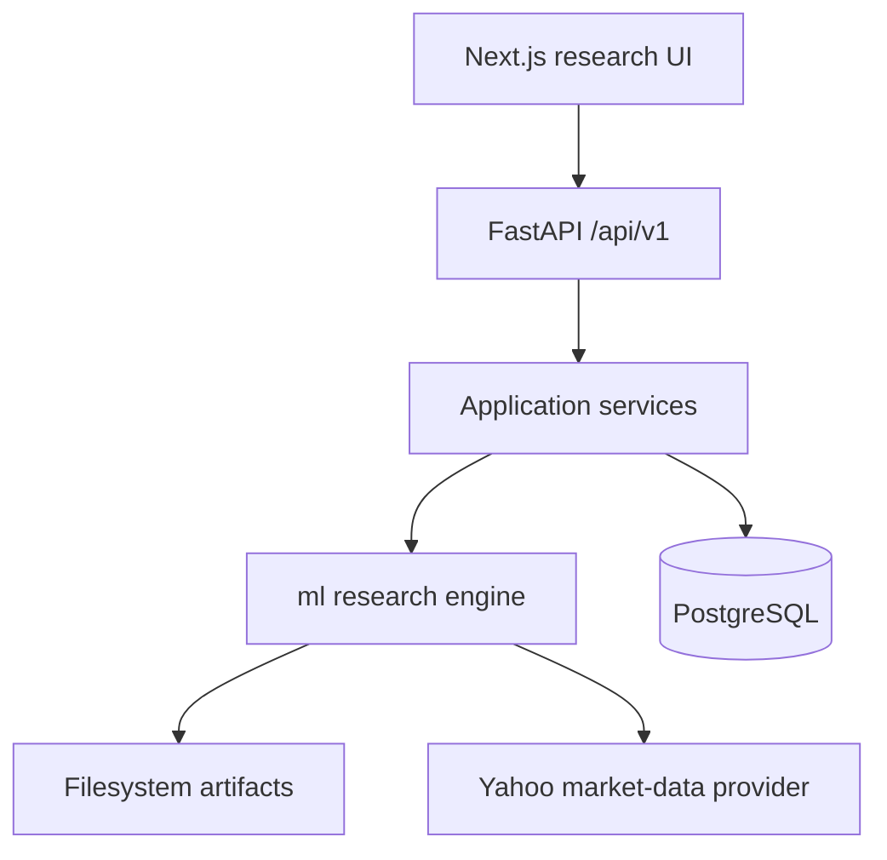
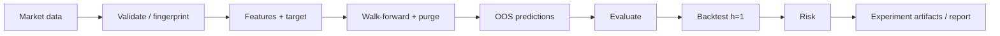

# AI-Powered Quantitative Research & Market Intelligence Platform

A modular full-stack platform for **leakage-resistant** financial machine learning research:
market data → features → models → walk-forward validation → cost-aware backtesting → risk → reproducible reports.

Built as a serious research system — not a “predict stocks with LSTM” tutorial, and **not** financial advice.

> In a multi-asset walk-forward study (AAPL, MSFT, NVDA, SPY; 2018–2025; experiment `7cb28b547e7c63e2`), **naive and linear models beat the LSTM on MAE/RMSE**. Negative results are first-class outcomes here.

[Architecture](docs/architecture/SYSTEM_DESIGN.md) · [Methodology](docs/research/METHODOLOGY.md) · [Empirical report](docs/final-research-report.md) · [Feature inventory](docs/startup/FEATURE_INVENTORY.md)


---

## Why this exists

Ad-hoc notebooks and demo LSTMs often leak the future, tune on the test set, hide failed experiments, and invent impressive metrics.

This repository prioritizes:

- chronological, purged evaluation
- baseline comparisons under identical rules
- transaction-cost-aware historical simulation
- provenance for datasets, configs, and reports
- tests that protect research integrity

## Core capabilities (implemented)

| Area | What exists |
|------|-------------|
| Market data | Provider abstraction (Yahoo), validation, optional `adj_close`, dataset fingerprints |
| Features / targets | Leakage-aware feature pipeline; future-return and direction targets |
| Models | Naive, linear/logistic, random forest, gradient boosting, PyTorch LSTM |
| Validation | Expanding/rolling walk-forward with purge; train-only scaling per fold |
| Evaluation | MAE, RMSE, directional accuracy, and related metrics |
| Backtesting | Signal → next-bar execution (`h=1`), costs/slippage, fold-aware stitching |
| Risk | Sharpe, Sortino, drawdown, Calmar, historical VaR/ES, beta helpers |
| Research ops | Multi-asset research pipeline, markdown report renderer, empirics artifacts |
| Product surface | FastAPI `/api/v1`, PostgreSQL/Alembic, Next.js research dashboard, Docker Compose, CI |
| Foundations | Domain contracts, model registry (filesystem), monitoring helpers, news/NLP ports, optional API key |

**Partial / not production-complete:** live news credentials, LLM copilot provider, multi-user accounts/watchlists, Redis/Celery workers, hardened cloud deploy.

## Research integrity

- No fabricated metrics or placeholder results presented as real
- Walk-forward out-of-sample predictions (not in-sample scoreboards)
- Purging for forecast horizon leakage
- Fail-loud multi-horizon backtests (engine supports `h=1` today)
- Explicit **unadjusted** Yahoo price basis (adjusted close is optional metadata, not a silent switch)

## Architecture



Canonical write-up: [docs/architecture/SYSTEM_DESIGN.md](docs/architecture/SYSTEM_DESIGN.md).

## Quantitative research pipeline



Entry points: `ml/research/pipeline.py`, `python -m scripts.run_startup_empirical_study`.

## Empirical results (honest excerpt)

**Experiment** `7cb28b547e7c63e2` · **Universe** AAPL, MSFT, NVDA, SPY · **Period** 2018-01-01 → 2025-01-01 · **Price basis** unadjusted Yahoo close · **Validation** expanding walk-forward with purge · **Horizon** 1 · **Folds** 22 · **Costs (base backtest)** 10 bps + 5 bps slippage

Mean OOS MAE (lower is better):

| Symbol | Naive | Linear | Gradient boosting | LSTM |
|--------|------:|-------:|------------------:|-----:|
| AAPL | **0.0138** | 0.0167 | 0.0222 | 0.0302 |
| MSFT | **0.0130** | 0.0178 | 0.0200 | 0.0337 |
| NVDA | **0.0244** | 0.0305 | 0.0340 | 0.0460 |
| SPY | **0.0085** | 0.0127 | 0.0118 | 0.0273 |

Full tables, fold diagnostics, and limitations: [docs/final-research-report.md](docs/final-research-report.md) · [docs/research/empirics/](docs/research/empirics/).

## Product screenshots

No committed UI screenshots yet (avoid outdated or fabricated captures).

Suggested captures for later: market overview, features page, walk-forward results, backtest equity, experiments list. Store under `docs/screenshots/` when available.

## Technology stack

- **Python 3.12** — pandas, NumPy, scikit-learn, PyTorch
- **FastAPI** + SQLAlchemy + Alembic + PostgreSQL
- **Next.js** + TypeScript + Recharts (Node ≥ 20)
- **Docker Compose** + GitHub Actions CI

## Repository structure

```text
backend/     FastAPI app, services, persistence
ml/          Quantitative + ML research engine
frontend/    Next.js research dashboard
alembic/     Database migrations
tests/       Pytest suite + architecture/contract tests
docs/        Architecture, methodology, startup audits, empirics
scripts/     Health checks, config printer, empirical study runner
```

## Quick start

```bash
python3.12 -m venv .venv
source .venv/bin/activate
pip install -r requirements.txt -r requirements-dev.txt
cp .env.example .env

cd frontend && npm install && cp .env.example .env.local && cd ..
docker compose up --build
```

- UI: http://localhost:3000  
- API docs: http://localhost:8000/docs  

Manual Postgres + API + frontend steps: [docs/startup/DEVELOPER_WORKFLOW.md](docs/startup/DEVELOPER_WORKFLOW.md).

Reproduce the startup empirics (network required):

```bash
python -m scripts.run_startup_empirical_study --write-docs-report
```

## Testing

```bash
ruff check backend tests ml scripts
pytest -q
PYTHONPATH=. python -m scripts.check_repo_health

cd frontend   # Node ≥ 20
npm test
npm run build
```

## Reproducibility

- Research configs fingerprint via `FinalResearchConfig.fingerprint()`
- Dataset identity helpers in `ml/data/fingerprint.py`
- Committed empirics summaries under `docs/research/empirics/`
- Exact bitwise reproduction across hardware/BLAS stacks is not guaranteed; methodology and config IDs are.

## API

Versioned research API under `/api/v1` (market data, features, analysis, models, experiments, walk-forward, backtests, health/ready). Prediction GETs read persisted OOS rows and do not train.

## Documentation

| Doc | Purpose |
|-----|---------|
| [SYSTEM_DESIGN.md](docs/architecture/SYSTEM_DESIGN.md) | Product / domain architecture |
| [METHODOLOGY.md](docs/research/METHODOLOGY.md) | Research methodology |
| [FEATURE_INVENTORY.md](docs/startup/FEATURE_INVENTORY.md) | Capability status (honest) |
| [ROADMAP.md](docs/startup/ROADMAP.md) | Startup roadmap |
| [ADRs](docs/adr/README.md) | Architecture decisions |

## Limitations

- Research and education only — **not** investment advice
- No live trading or brokerage execution
- Default market data is Yahoo historical (quality/survivorship limits apply)
- Backtests are historical simulations with simplified costs
- Auth is optional API-key mode today (not a full multi-user product)

## Roadmap

See [docs/startup/ROADMAP.md](docs/startup/ROADMAP.md) and [PRODUCTION_READINESS.md](docs/startup/PRODUCTION_READINESS.md). Production SaaS hardening (users, workers, live providers, deploy) remains in progress.

## Disclaimer

This software is for research and educational purposes only. It does not provide financial advice. Historical simulations and model outputs do not guarantee future performance.
