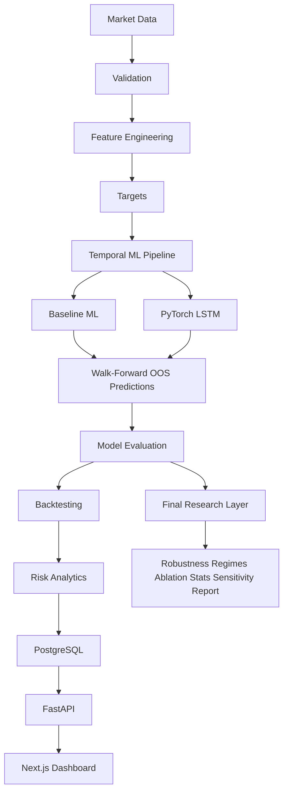

# System Architecture

**Status: core platform implemented** (phases 1–15).

## Flow



```text
Market Data
    ↓
Validation
    ↓
Feature Engineering
    ↓
Targets
    ↓
Temporal ML Pipeline
    ↓
┌───────────────┬────────────────┐
│ Baseline ML   │ PyTorch LSTM   │
└───────┬───────┴───────┬────────┘
        ↓               ↓
      Walk-Forward OOS Predictions
                 ↓
          Model Evaluation
                 ↓
             Backtesting
                 ↓
           Risk Analytics
                 ↓
            PostgreSQL
                 ↓
              FastAPI
                 ↓
          Next.js Dashboard
```

## Layer Responsibilities

### Data Layer

Acquire historical market data, preserve source metadata, validate schemas and
timestamps, normalize OHLCV, and persist local research extracts (`ml/data/`).

### Quantitative Research Layer

Returns, volatility, drawdown, correlations, leakage-aware feature engineering,
supervised targets, and final evaluation utilities (`ml/analysis/`,
`ml/features/`, `ml/targets/`, `ml/research/`).

### Machine Learning Layer

Baseline models, LSTM sequence models, train-only preprocessing, chronological
splits, walk-forward validation, and OOS prediction collection (`ml/models/`,
`ml/neural/`, `ml/training/`, `ml/validation/`).

### Backtesting Layer

Signals, execution alignment, costs/slippage, equity curves, risk metrics,
benchmarks, and cost/threshold sensitivity (`ml/backtesting/`,
`ml/research/sensitivity.py`).

### Backend/API Layer

FastAPI `/api/v1` health/ready, market data, analysis, features, models,
experiments, walk-forward, and backtests with SQLAlchemy + Alembic + PostgreSQL.

### Frontend Layer

Next.js TypeScript research dashboard for market, features, experiments,
walk-forward analytics, and backtest risk views.

## Design Boundaries

- Data acquisition stays separate from research transforms.
- Training stays separate from inference/evaluation.
- Evaluation preserves temporal order; no future leakage.
- API/frontend consume documented outputs; research formulas live in `ml/`.
- Negative LSTM results are valid and must not be hidden.
