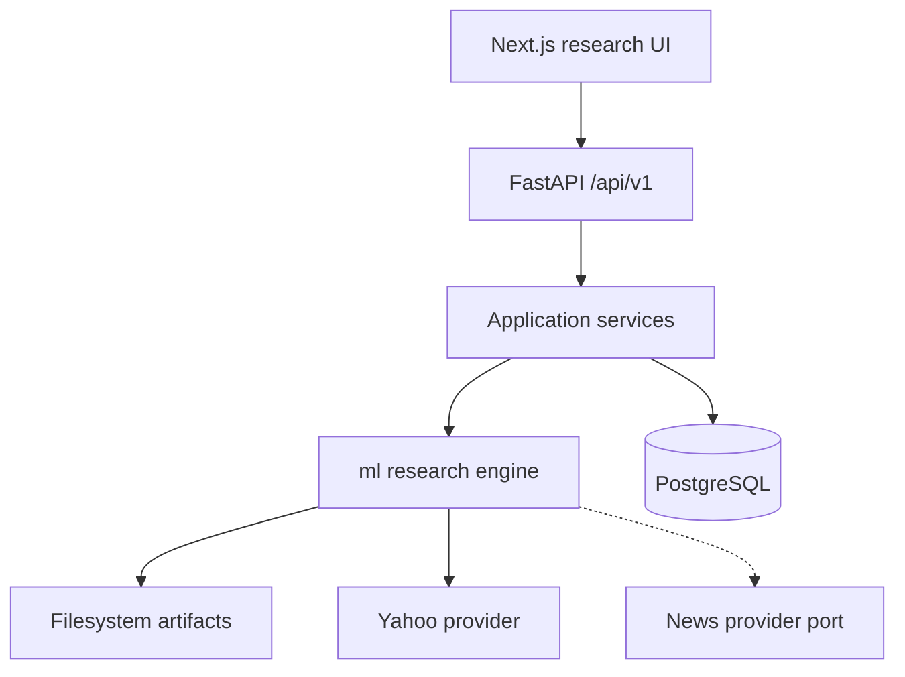

# System Design — AI Quantitative Research Platform

**Status:** CURRENT modular monolith + documented future ports  
**Date:** 2026-09-13

## Product architecture

## Domain packages (`ml/`)

| Package | Responsibility |
|---------|----------------|
| `data` | Provider ingest, validation, fingerprints, instruments |
| `features` / `targets` | Leakage-aware transforms |
| `models` / `neural` / `training` | Baselines + LSTM |
| `validation` | Walk-forward, purge, fold preprocess |
| `evaluation` / `backtesting` / `risk` | Metrics and simulation |
| `research` | Multi-asset orchestration + report |
| `registry` / `monitoring` | Model lifecycle + drift/perf helpers |
| `news` / `nlp` | News ports + keyword sentiment baseline |
| `ai` | Evidence-grounded tools + safety filters |
| `portfolio` | Analytical holdings (no brokerage) |
| `contracts` / `errors` | Boundary types |

## Application layer (`backend/app/`)

Routes → services → repositories/DB + `ml` domain. Optional `AUTH_API_KEY`. In-process job queue skeleton.

## Data flow (research)

Provider → OHLCV validate → dataset fingerprint → features + target → purged WF → predictions → evaluation → signals → h=1 backtest → risk → experiment artifacts → API/UI.

## Security / ops notes

- Secrets never in `NEXT_PUBLIC_*` or safe config summaries  
- No committed `.env`  
- Auth optional (single-user default)  
- Observability: structured logs + request IDs; OTEL deferred  

## Honest gaps

Multi-user auth UI, Redis cache, Celery workers, licensed news, SOTA NLP, cloud deploy, and full model-serving pipeline remain incomplete — see startup scorecard.
