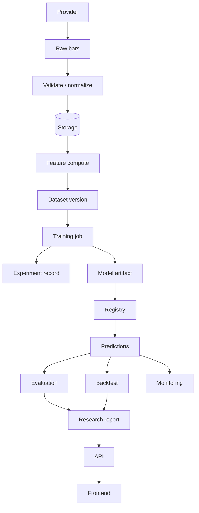

# Data Flow Architecture

This document distinguishes **current** flows from **future-state** flows for the research platform.

---

## Desired end-to-end flow

```text
Provider
  → Raw ingestion
  → Validation
  → Normalization
  → Storage
  → Feature computation
  → Dataset version
  → Training
  → Experiment
  → Model artifact
  → Registry
  → Prediction
  → Evaluation
  → Backtesting
  → Monitoring
  → Research output
  → API
  → Frontend
```

---

## Step status

| Step | Status | Current evidence | Future-state gap |
|------|--------|------------------|------------------|
| Provider | CURRENT | `YahooFinanceProvider` | Multi-provider, licensed real-time |
| Raw ingestion | CURRENT | `MarketDataIngestionService` | Scheduled jobs, warehouse |
| Validation | CURRENT | `validate_ohlcv` | Richer OHLC integrity, corporate actions |
| Normalization | CURRENT | `normalize_ohlcv` | Adjusted/unadjusted policy flags |
| Storage | PARTIAL | CSV under `data/raw` (gitignored); API mostly live fetch | Canonical bar tables + partitions |
| Feature computation | CURRENT | `build_features` (+ API on-demand) | Persisted feature store + versions |
| Dataset version | FUTURE | Config fingerprints in research config only | Immutable dataset_id/version |
| Training | CURRENT (offline) | `ml/training`, models, WF evaluators | Jobbed training with resource limits |
| Experiment | PARTIAL | DB experiment rows + metrics | Full provenance contract |
| Model artifact | PARTIAL | Checkpoint helpers; not full registry | Object store + hashes |
| Registry | FUTURE | Hardcoded model catalog API | Versioned registry |
| Prediction | PARTIAL | OOS preds persisted; GET predictions unused by UI | Batch/online inference services |
| Evaluation | CURRENT | `ml/evaluation` | Linked always to experiment_id |
| Backtesting | CURRENT | `ml/backtesting` + DB | Multi-horizon, richer costs |
| Monitoring | FUTURE | — | Drift/decay jobs |
| Research output | PARTIAL | Report renderer; empirics awaiting | Published attested reports |
| API | CURRENT | FastAPI `/api/v1` | Authz, job APIs |
| Frontend | CURRENT | Next.js dashboard | Copilot/watchlists/alerts |

---

## Data classes

### RAW DATA

- Provider OHLCV pulls; CSV extracts in `data/raw/`  
- Immutable in principle; do not overwrite without versioning  

### DERIVED DATA

- Normalized frames, cleaned calendars, optional adjusted series  
- Still not features  

### FEATURES

- Outputs of `ml/features`  
- Must use only information available at decision time under documented assumptions  

### TARGETS

- Future returns / direction labels  
- Never included in `X`  

### MODEL ARTIFACTS

- Weights, scalers, training configs, code version  
- Today: local checkpoints possible; not systematically registered  

### PREDICTIONS

- OOS prediction rows (walk-forward)  
- Persisted in PostgreSQL prediction tables  

### BACKTEST RESULTS

- Equity curves, strategy metrics, cost assumptions  
- Persisted backtest + metrics tables  

### RESEARCH REPORTS

- Markdown/structured reports from `render_final_research_report`  
- Empirics remain placeholders until a real run is recorded  

---

## Current primary runtime flows

### A. Live dashboard diagnostics

```text
UI → API → Yahoo (TTL cache) → analysis/features → UI
```

No experiment artifact created.

### B. Offline research → persist → UI

```text
Operator script/notebook
  → ml research/WF/backtest
  → research_persistence / repositories
  → PostgreSQL
  → API GET
  → UI
```

### C. On-demand backtest API (exists, unused by UI)

```text
POST /backtests with explicit OOS payload → ml.backtesting → response
```

---

## Mermaid — future logical flow



---

## Integrity rules

1. Never promote live Yahoo diagnostics to “experiment results” without provenance.  
2. Never mix training artifacts across dataset versions silently.  
3. Frontend may format, not redefine, financial metrics (except clearly labeled chart helpers).  
4. Monitoring consumes predictions/features; it does not retrain silently.  
