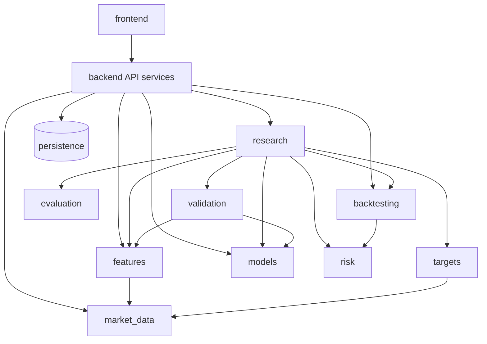

# Domain Boundaries

Purpose: keep the modular monolith from becoming a ball of mud as Phase 2–15 features land.

Dependency rule of thumb: **inner domain libraries (`ml/`) must not import FastAPI, Next.js, or UI code.** API services may import `ml/`. Frontend may not reimplement domain math beyond presentation helpers.

---

## Domains

### `market_data`

- **Responsibility:** Acquire, normalize, validate, and serve OHLCV  
- **Belongs:** providers, request validation, schema, storage adapters, freshness metadata  
- **Does not belong:** features, models, backtests, UI formatting  
- **Allowed deps:** pandas/numpy, provider SDKs, settings  
- **Public interfaces:** `MarketDataProvider`, ingestion service, API market-data DTOs  

### `features`

- **Responsibility:** Leakage-aware feature construction and validation  
- **Belongs:** lag/momentum/trend/vol/volume/indicators, feature schemas/version ids (future)  
- **Does not belong:** targets used as inputs, model training, backtest costs  
- **Allowed deps:** `market_data` outputs (frames), pandas  
- **Public interfaces:** `build_features`, `validate_features`  

### `research` (quant analysis)

- **Responsibility:** Exploratory stats, regimes, ablation orchestration helpers, report structuring  
- **Belongs:** returns/vol/drawdown summaries, research pipeline coordination, diagnostics  
- **Does not belong:** HTTP routing, user accounts  
- **Allowed deps:** `features`, `models`, `evaluation`, `validation`, `backtesting`  
- **Public interfaces:** `run_final_research_evaluation`, analysis helpers  

### `models`

- **Responsibility:** Model definitions and fit/predict APIs  
- **Belongs:** naive/linear/tree/boosting/LSTM wrappers  
- **Does not belong:** walk-forward orchestration, persistence, UI catalog hardcoding long-term  
- **Allowed deps:** features matrices, training utilities, torch/sklearn  
- **Public interfaces:** model classes with `fit`/`predict`  

### `evaluation`

- **Responsibility:** Predictive metrics from actual vs predicted  
- **Belongs:** regression/classification metrics  
- **Does not belong:** trading PnL, Sharpe (those are backtest/risk)  
- **Allowed deps:** numpy/sklearn  
- **Public interfaces:** `evaluate_regression`, `evaluate_classification`  

### `backtesting`

- **Responsibility:** Signals → execution alignment → costs → strategy returns  
- **Belongs:** engine, costs, fold-aware stitch, strategy metrics  
- **Does not belong:** feature engineering, news NLP  
- **Allowed deps:** predictions, price/return series  
- **Public interfaces:** `run_backtest`, `run_fold_aware_backtest`  

### `risk`

- **Responsibility:** Risk measures and diagnostics over return/equity paths  
- **Belongs:** drawdown, vol, Sharpe/Sortino definitions, future VaR/ES  
- **Does not belong:** signal generation  
- **Allowed deps:** return series  
- **Public interfaces:** metric functions (today split across `ml/analysis` and `ml/backtesting/metrics`)  
- **Note:** consolidate conceptually under risk in later phases without breaking imports overnight  

### `news` (future)

- **Responsibility:** Ingest and store financial news with timestamps  
- **Does not belong:** silent joining onto features without point-in-time rules  

### `nlp` (future)

- **Responsibility:** Sentiment/theme extraction with model cards  
- **Does not belong:** portfolio optimization  

### `portfolio` (future)

- **Responsibility:** Multi-asset allocation analytics  
- **Does not belong:** single-asset feature pipelines  

### `ai_research` (future)

- **Responsibility:** Evidence-grounded copilot over persisted artifacts  
- **Does not belong:** unconstrained market advice; must cite experiment ids  

### `users` / `watchlists` / `alerts` (future)

- **Responsibility:** Identity, saved symbols/research, notification rules  
- **Does not belong:** ML training logic  

### `jobs`

- **Responsibility:** Async execution, retries, progress  
- **Belongs (future):** queues, schedulers  
- **Does not belong:** domain formulas  

### `observability`

- **Responsibility:** Logging, metrics, tracing, audit trails  
- **Belongs:** request context, redaction  
- **Does not belong:** business metric fabrication  

---

## Allowed dependency direction

Forbidden: `ml/*` → `backend.app` or `frontend/*`.

---

## Boundary enforcement tactics (later)

- Keep packages import-linter / tests like existing API contract tests  
- Prefer passing frames/DTOs over reaching into foreign internals  
- New domains get a folder + README/ADR when introduced  
