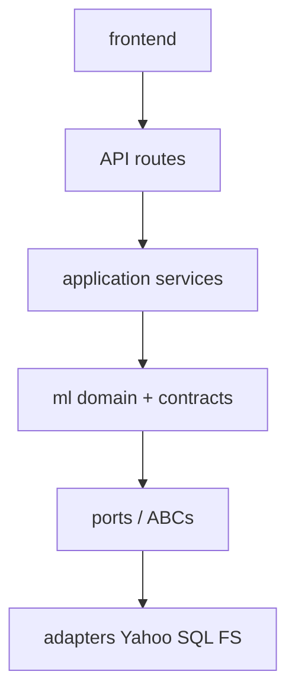

# Domain Boundaries

Purpose: keep the modular monolith from becoming a ball of mud as Phase 2–15 features land.

**Dependency rule:** `ml/` (domain) must not import FastAPI, Next.js, backend schemas, or UI code.  
API services may import `ml/`. Frontend may not reimplement domain math beyond presentation helpers.

See also: [`DOMAIN_DEPENDENCY_MAP.md`](DOMAIN_DEPENDENCY_MAP.md), [`INTERNAL_CONTRACTS.md`](INTERNAL_CONTRACTS.md).

---

## CURRENT domains

### `market_data`

- **Purpose:** Acquire, normalize, validate, serve OHLCV  
- **Owned:** providers, request validation, schema, CSV storage, symbols  
- **Inputs:** symbol + date range  
- **Outputs:** OHLCV frames / API pages  
- **Allowed deps:** pandas; provider SDKs **only inside adapters**  
- **Forbidden:** features, models, backtests, FastAPI  

### `features`

- **Purpose:** Leakage-aware feature construction  
- **Inputs:** validated OHLCV  
- **Outputs:** feature frames (+ warm-up NaNs)  
- **Allowed:** market_data frames, `ml.analysis.returns` helpers  
- **Forbidden:** downloads, training, HTTP  

### `targets`

- **Purpose:** Future-return / direction labels  
- **Forbidden:** inclusion in model `X`  

### `datasets`

- **Purpose:** Assemble supervised frames; drop incomplete rows  
- **Public:** `SupervisedFrame`, `assemble_supervised`, `DatasetSpec`  

### `models`

- **Purpose:** Fit/predict implementations  
- **Public:** model classes; `Predictor` Protocol for tabular baselines  
- **Forbidden:** walk-forward orchestration, DB sessions  

### `evaluation`

- **Purpose:** Predictive metrics from actual vs predicted  
- **Forbidden:** trading PnL / Sharpe (backtest/risk)  

### `walk_forward` (`ml.validation`)

- **Purpose:** Temporal folds, purge, retrain, OOS collection  
- **Forbidden:** HTTP/UI  

### `backtesting`

- **Purpose:** Signals → h=1 execution → costs → equity/metrics  
- **Forbidden:** retraining; silent multi-horizon  

### `risk`

- **Purpose (CURRENT):** drawdown/vol/Sharpe/Sortino on return paths  
- **Note:** ownership still split (`ml.analysis` vs `ml.backtesting.metrics`) — TD-021  

### `research`

- **Purpose:** Final evaluation orchestration + diagnostics/report  
- **Allowed:** features/targets/models/validation/evaluation/backtesting  

### `contracts`

- **Purpose:** Typed boundary objects (`ml.contracts`)  
- **Forbidden:** network I/O, SQLAlchemy  

### `application` / `api` / `persistence`

- **Purpose:** Orchestration, HTTP, Postgres  
- **Allowed:** call into `ml` + repositories  
- **Forbidden:** reimplementing quant formulas in routes  

---

## FUTURE domains (docs only — no empty packages)

`news`, `nlp`, `portfolio`, `ai_research`, `users`, `watchlists`, `alerts`, `jobs`, `monitoring`

---

## Allowed dependency direction

Forbidden: `ml/*` → `backend.app` or `frontend/*`.
