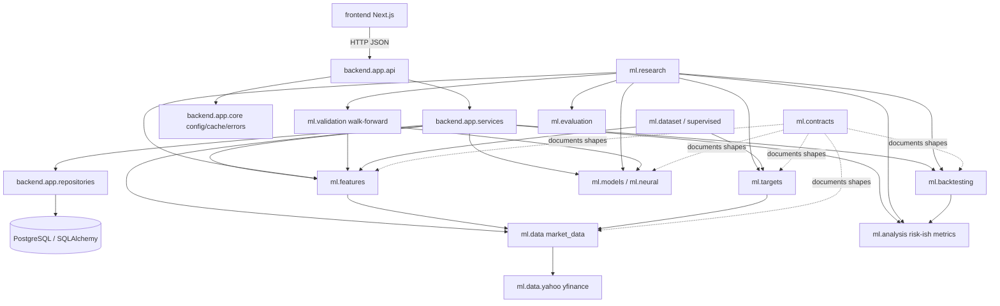

# Domain Dependency Map

Audit date: 2026-09-13 (Prompt 4)

## CURRENT STATE (verified from imports)



### Domain table (CURRENT)

| Domain | Modules | Depends on | Dependents | External | Persistence | Violations |
|--------|---------|------------|------------|----------|-------------|------------|
| market_data | `ml/data/*` | pandas, yfinance (adapter only) | features, targets, services | Yahoo | optional CSV | None material — yfinance confined |
| features | `ml/features/*` | market_data frames, analysis.returns | supervised, research, API features svc | — | none | None |
| targets | `ml/targets/*` | close series | supervised, research | — | none | None |
| datasets | `ml/dataset.py`, `boundaries.py`, `supervised.py` | features, targets | models, validation | — | none | None |
| models | `ml/models/*`, `ml/neural/*`, `ml/training/*` | matrices, torch/sklearn | validation, research, comparison | — | checkpoints optional | None |
| evaluation | `ml/evaluation/*` | numpy/sklearn | validation, research | — | none | None |
| walk_forward | `ml/validation/*` | models, preprocessing | research, persistence writers | — | via backend repos | None |
| backtesting | `ml/backtesting/*` | predictions, returns | research, API backtest svc | — | via backend repos | h>1 fail-loud |
| risk (partial) | `ml/analysis/*` + `backtesting/metrics.py` | return series | analysis API, backtests | — | none | Split ownership (TD-021) |
| research | `ml/research/*` | many ml domains | offline scripts/notebooks | — | optional | Diagnostics use unpurged splits (TD-003) |
| application | `backend/app/services/*` | ml + repos + config | API routes | Yahoo via provider | SQLAlchemy | Acceptable orchestration |
| API | `backend/app/api/*` | services, schemas | frontend | — | via deps | Routes stay thin (verified) |
| persistence | `backend/app/db/*`, repositories | SQLAlchemy | services | Postgres | yes | Domain algos do not take Session |
| contracts | `ml/contracts/*` | dataclasses/Protocol | tests, docs, light wiring | — | none | NEW Prompt 4 |
| frontend | `frontend/*` | HTTP contracts | users | — | none | Chart helpers only (TD-008) |

### Known remaining couplings (DEFERRED)

| Issue | Classification |
|-------|----------------|
| Risk metrics split across analysis vs backtesting | DEFER (TD-021) |
| Repositories normalize symbols inline vs `ml.data.symbols` | DEFER (TD-024) |
| Research diagnostics use unpurged chronological splits | DEFER (TD-003) — methodology |
| SQLAlchemy models used near API schemas | JUSTIFY — acceptable for persistence DTOs; not passed into `ml/` |

---

## TARGET STATE

Same modular monolith, with future domains (`news`, `nlp`, `portfolio`, `ai_research`, `users`, `jobs`, `monitoring`) attaching through application services and ports — **packages created only when implemented**.

```text
HTTP/UI → Application services → Domain (ml + contracts) → Ports → Adapters (Yahoo, SQL, FS)
```
