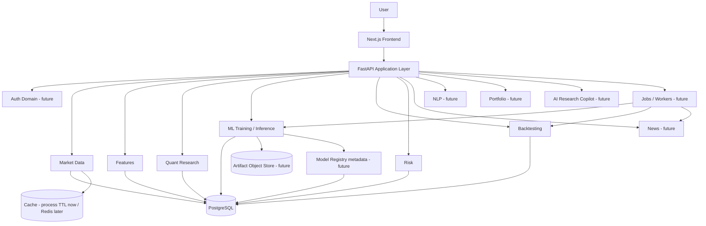

# Target Architecture

Audit date: 2026-09-13  
Decision stance: **modular monolith first** (matches the existing FastAPI + `ml/` + Next.js + PostgreSQL shape). Do not introduce microservices unless a concrete scaling/isolation need appears.

---

## Current vs target

| Layer | Current | Target (startup) |
|-------|---------|------------------|
| Frontend | Next.js research dashboard | Same; richer research UX later |
| API | FastAPI `/api/v1` | Same modular API; versioned contracts |
| Domain engine | `ml/` package imported by services | Keep in-process domain libraries |
| Persistence | PostgreSQL + Alembic | Same + richer provenance schema |
| Cache | In-process TTL | Redis only when multi-instance requires it |
| Jobs | Offline scripts / sync requests | Background workers + scheduler |
| Artifacts | Local/CSV/DB JSON fields | Object storage + model registry metadata |
| Auth | None | Users/sessions (later phase) |
| Observability | Basic logging/middleware | Structured logs + metrics + tracing |

---

## High-level diagram



---

## Component sheets

### Frontend

- **Responsibility:** Present research artifacts; collect query params; never invent metrics  
- **Interfaces:** HTTP JSON via `frontend/lib/api`  
- **Inputs:** User navigation/filters  
- **Outputs:** Rendered views; no writes to research DB today  
- **Persistence:** None (browser only)  
- **Scaling:** SSR/static as needed; CDN later  
- **Failure:** `StatePanel` empty/error states  

### Application / API layer

- **Responsibility:** Authz (future), validation, orchestration, DTO mapping  
- **Interfaces:** `/api/v1/*` routers → services → `ml/` / repositories  
- **Inputs:** HTTP requests  
- **Outputs:** JSON schemas in `backend/app/schemas`  
- **Persistence:** via SQLAlchemy session  
- **Scaling:** Horizontal API replicas behind load balancer once cache/session externalized  
- **Failure:** typed errors; no secret leakage in 500s  

### Market Data domain

- **Responsibility:** Provider fetch, normalize, validate, cache reads  
- **Inputs:** symbol, date range  
- **Outputs:** OHLCV frames / API pages  
- **Persistence:** optional CSV + future DB bars  
- **Failure:** empty/invalid → 4xx/empty; no silent fill  

### Quant Research / Features / ML / Backtesting / Risk

- **Responsibility:** Pure domain logic in `ml/`  
- **Interfaces:** Python functions/classes called by services or jobs  
- **Persistence:** results via repositories, not hidden globals  
- **Scaling:** CPU/GPU workers for training; keep library in-process  
- **Failure:** raise; caller records failed experiment status  

### News / NLP / Portfolio / AI Research (future)

- Separate domains with explicit interfaces; no feature leakage across timestamps.  
- Copilot must cite persisted artifacts; never fabricate metrics.

### PostgreSQL

- Experiments, metrics, walk-forward, predictions, backtests, future users/watchlists  
- Source of truth for served research results  

### Cache

- Now: process TTL for market OHLCV  
- Later: Redis if multiple API workers need shared cache  

### Background workers / scheduler (future)

- Long trainings, scheduled ingest, alert evaluation  
- Queue + idempotent job records  

### Object / artifact storage (future)

- Model weights, report files, dataset snapshots  
- DB stores metadata + hashes; blobs in object store  

### Logging / metrics / monitoring (future expansion)

- Request logs exist; add RED/USE metrics, traces, model monitors in later phases  

---

## Why not microservices now

Existing coupling is library-import based and testable in one pytest suite. Splitting ML into a separate network service would add serialization/versioning cost without current scale need. Revisit only if:

- training workloads need isolated autoscaling, or  
- team/process boundaries require separate deploy units.

---

## Deployment shape (target)

```text
[Browser] → [Next.js] → [FastAPI modular monolith] → [PostgreSQL]
                                         ↘ [Workers]
                                         ↘ [Object storage]
                                         ↘ [Redis optional]
```

Docker Compose remains the local baseline; cloud deploy arrives in Phase 15.
