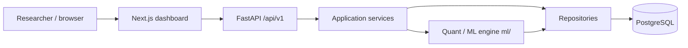
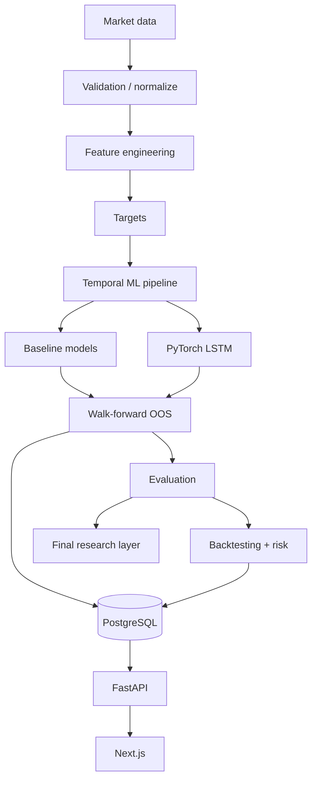
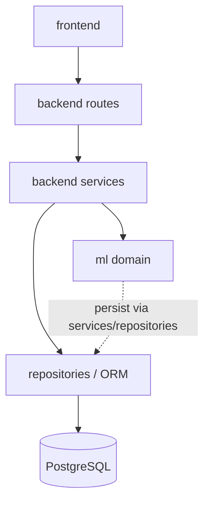

# System Design

This document describes the **actual** modular-monolith research platform after
the final engineering pass. It documents implemented capability and integrity
controls. It does **not** invent empirical research results or profitability
claims.

## 1. Goals

- Provide a leakage-safe chronological ML research stack for short-horizon
  equity return / direction forecasting.
- Compare simple baselines against a PyTorch LSTM under the same temporal rules.
- Collect true walk-forward out-of-sample (OOS) predictions.
- Evaluate economic usefulness with transaction-cost-aware historical
  backtests and risk analytics.
- Persist experiments, OOS predictions, walk-forward runs, and backtests in
  PostgreSQL.
- Expose read-oriented research APIs (FastAPI) and a Next.js dashboard that
  visualizes **persisted** artifacts.
- Prefer empty or unavailable states over fabricated metrics.

## 2. Non-Goals

- Live trading, brokerage APIs, order routing, or paper-trading execution
- Multi-tenant authentication / authorization for a public SaaS product
- Guaranteed profitable strategies or promotional LSTM claims
- Microservices, event buses, or distributed training clusters
- Background job queues for long-running experiments (research runs offline)
- Storing model weight blobs inside PostgreSQL

## 3. Architecture Overview

The system is an **intentional modular monolith**: one deployable research
stack with clear internal boundaries. The research pipeline is **offline**;
the dashboard primarily **reads persisted artifacts**.

## 4. Module Boundaries

| Layer | Location | Responsibility |
|-------|----------|----------------|
| Data | `ml/data/` | Provider abstraction, validation, local extracts |
| Analysis | `ml/analysis/` | Returns, volatility, drawdown, summary stats |
| Features | `ml/features/` | Leakage-aware feature construction + validation |
| Targets | `ml/targets/` | Future return and direction labels (separate from features) |
| Models | `ml/models/` | Baseline regression / classification |
| Neural | `ml/neural/` | Sequence construction, LSTM architectures, loaders |
| Training | `ml/training/` | Chronological training, early stopping, checkpoints |
| Validation | `ml/validation/` | Walk-forward folds, purging, OOS collection |
| Backtesting | `ml/backtesting/` | Signals, execution alignment, costs, fold-aware stitching |
| Research | `ml/research/` | Multi-asset, regimes, ablation, stats, sensitivity, report |
| Backend API | `backend/app/api/` | Thin HTTP routes |
| Services | `backend/app/services/` | API orchestration |
| Persistence | `backend/app/repositories/`, `backend/app/db/` | SQLAlchemy + PostgreSQL |
| Frontend | `frontend/` | Research dashboard over `/api/v1` |

## 5. Dependency Direction

Allowed dependency flow (higher layers may call lower; reverse is forbidden):

Rules:

- `frontend` never imports Python or connects to PostgreSQL.
- Routes do not embed quantitative formulas; they call services.
- Repositories do not call FastAPI or Next.js.
- `ml/` must not depend on FastAPI request objects or frontend types.
- Persistence schemas (Pydantic) are the public API contracts; ORM models are
  internal.

## 6. Market-Data Flow

1. Client requests `GET /api/v1/market-data/{symbol}` with `start_date`, optional
   `end_date`, and optional `limit` / `offset`.
2. Ticker path values are validated/normalized.
3. Service fetches via the market-data provider abstraction (Yahoo Finance
   implementation available; tests use fixtures).
4. Bars are validated/normalized; responses include pagination metadata
   (`total`, `count`, `limit`, `offset`, `returned`) capped by
   `MAX_MARKET_ROWS` and date span by `MAX_MARKET_DATA_DAYS`.
5. Optional short-lived in-process cache reduces repeat provider calls (single
   process only).

Analysis and feature routes reuse the same market-data service path before
calling `ml/` transforms.

## 7. ML Training

Offline research training (notebooks / `ml/research/pipeline.py` / scripts):

1. Assemble supervised frames with features and **separated** targets.
2. Fit scalers / preprocessors on training rows only.
3. Train baselines (`ml/models/`) or LSTM (`ml/neural/`, `ml/training/`) with
   chronological splits and validation-only early stopping.
4. Persist experiment metadata and checkpoint **references** (paths/URIs), not
   weight blobs in the database.

### Direction label semantics

Binary direction when a future return is defined:

- `1` if `future_return > 0`
- `0` otherwise (flat / non-positive)
- `NaN` future returns stay missing (not coerced to class 0)

### LSTM sequence context

Partition sequences may use **prior within-fold partition features** as lookback
context only (`create_dated_sequences_with_context`). Targets and target dates
come solely from the evaluation partition; context targets are never used as
labels.

## 8. Walk-Forward and Out-of-Sample Predictions

- Expanding / rolling walk-forward configs with forecast-horizon purging and
  optional gaps.
- Each fold trains fresh models and emits predictions only on its test window.
- OOS predictions are collected and can be persisted as
  `OutOfSamplePrediction` rows linked to walk-forward runs / experiments.
- Aggregate stability metrics summarize fold variability without deleting bad
  folds.
- API prediction GETs read these rows; they never trigger training.

## 9. Backtesting

- Signals derive from OOS predictions only (no in-sample trading claims).
- Forward execution alignment; **strategy backtesting supports
  `forecast_horizon=1` only**.
- Configurable transaction costs and slippage (basis points).
- Equity curves, Sharpe / Sortino / drawdown / turnover, and buy-and-hold
  benchmarks on the matching realization window.

### Fold-aware OOS stitching

`ml/backtesting/fold_aware.py`:

- Overlapping prediction dates across folds **reject** a combined continuous
  backtest.
- Discontinuous trading-day calendars omit combined continuous annualization
  (weekend/holiday gaps allowed; missing business days are not).
- Per-fold backtests remain valid regardless of stitching.

API surface:

- `POST /api/v1/backtests` — synchronous run from explicit OOS payloads
- `GET /api/v1/backtests` / `GET /api/v1/backtests/{id}` — read persisted results

## 10. Persistence

PostgreSQL via SQLAlchemy 2.x + Alembic. Primary artifacts:

- Experiments and metrics
- Walk-forward runs and folds
- Out-of-sample predictions
- Backtests, metrics, and equity points

Repositories mediate all ORM access. Non-finite metric values normalize to
`NULL`. Unit tests may use temporary SQLite for offline determinism; production
shape is PostgreSQL.

## 11. API

Versioned under `/api/v1`. See [backend.md](backend.md) for the full route
table. Important integrity properties:

- Health vs ready separation
- Predictions GET = DB read only
- Experiments include `/related` links to walk-forward runs and backtests
- Market-data and features support explicit pagination
- Stable error envelopes; no stack traces to clients

## 12. Frontend

Next.js App Router dashboard (`frontend/`):

| Route | Role |
|-------|------|
| `/` | Overview / health |
| `/market` | Market OHLCV (paginated metadata) |
| `/features` | Feature explorer |
| `/models` | Model catalog |
| `/experiments`, `/experiments/[id]` | Experiment history + related links |
| `/walk-forward` | Fold analytics for a persisted run id |
| `/backtests` | Persisted / selectable historical simulations |

Distinguish:

- **Market** — raw OHLCV inspection
- **Predictions** — persisted model OOS forecasts (not live training)
- **Walk-forward / OOS** — fold structure and true OOS collections
- **Backtests** — strategy simulation on OOS inputs / stored runs

Browser talks only to FastAPI; never to PostgreSQL.

## 13. Deployment

Docker Compose runs PostgreSQL + FastAPI + Next.js. Backend entrypoint applies
Alembic then starts Uvicorn. Frontend image is **multi-stage production**
(`npm run build` / `npm run start`). CI (GitHub Actions) runs ruff, pytest,
frontend lint/typecheck/test/build, and migration checks.

See [deployment.md](deployment.md).

## 14. Failure Handling

- Provider / validation failures → `400` with stable codes
- Missing persisted resources → `404`
- Oversized bodies → `413`
- DB unavailable → readiness `503`; health may still be up
- Unexpected exceptions → generic `500` envelope
- Dashboard surfaces `ApiError` empty/error panels; does not fabricate numbers
- Fold-aware backtests raise on overlapping OOS dates rather than silently
  stitching

## 15. Security Boundary

**Local / private research**, not a public multi-user trading product.

- No authentication (intentional)
- CORS allowlists; empty origins by default in production unless configured
- Streaming request body size limits
- Ticker validation; pagination and row caps
- Security response headers
- Secrets stay in server env (never `NEXT_PUBLIC_*` for DB credentials)

## 16. Scalability

Designed for single-operator research workloads:

- In-process market-data cache (not Redis / multi-worker shared cache)
- Synchronous POST backtests (no job queue)
- Modular monolith keeps operational surface small
- Horizontal scale-out, multi-tenant isolation, and streaming ingestion are out
  of scope

## 17. Research-Integrity Controls

- Leakage-aware features; targets separated; chronological splits
- Train-only preprocessing; walk-forward purging / gaps
- Direction labels preserve missing tails
- LSTM context features do not leak context targets
- OOS-only economic evaluation; horizon=1 for strategy execution alignment
- Reject overlapping fold dates for combined continuous backtests; no
  continuous annualization across gaps
- Empty / awaiting placeholders over invented empirical results
- Final report renderer must not fabricate numbers
- Cost/threshold sweeps are diagnostic; no holdout cherry-picking for claims

## 18. Future Extensions

Labeled **future work only** (not implemented):

- Licensed real-time market feeds
- News / NLP sentiment
- Transformer sequence models
- Portfolio optimization / multi-asset allocation
- Paper trading
- Model monitoring
- Authentication for shared multi-user deployments

## Related Docs

- [architecture.md](architecture.md) — high-level flow
- [backend.md](backend.md) — API details
- [frontend.md](frontend.md) — dashboard
- [database.md](database.md) — persistence schema
- [deployment.md](deployment.md) — ops
- [research-methodology.md](research-methodology.md) — scientific method
- [final-research-report.md](final-research-report.md) — report template
